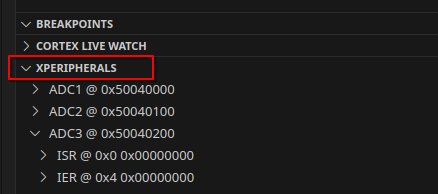

# Zig Meets C: Cross-Language Development for Embedded Microcontrollers

- [Zig Meets C: Cross-Language Development for Embedded Microcontrollers](#zig-meets-c-cross-language-development-for-embedded-microcontrollers)
  - [Description](#description)
  - [Issue](#issue)
  - [Examples List](#examples-list)
  - [Installation](#installation)
    - [Linux](#linux)
    - [Windows](#windows)
    - [Vs Code / Vs Codium](#vs-code--vs-codium)
    - [Containers (Podman or Docker)](#containers-podman-or-docker)
  - [SVD Files](#svd-files)
  - [Build](#build)
  - [For STM32CubeMX generated linker script](#for-stm32cubemx-generated-linker-script)
  - [Resources](#resources)


## Description

[Zig](https://ziglang.org/) is a language that seems perfect for embedded systems programming, and you might be considering incorporating Zig code into your embedded development projects. However, there are several reasons why you might not want just to start a project with it.

- You use a manufacturer-specific software generator (e.g., STM32CubeMX) to simplify device initialization and peripheral configuration. The generated code is in C.
- The project already exists, and rewriting it is not an option.
- Your future project rely heavily on C-based components, such as operating systems (e.g., FreeRTOS), filesystems (e.g., LittleFS), libraries, drivers, etc. You don’t want to rewrite initialization or configuration routines that already work well and are widely used elsewhere.
- You work with coworkers who will maintain, update, and/or test parts of the project's C code. They may not use Zig—either not yet or never.

This repository explores the integration of Zig and C for microcontroller development, covering both baremetal and OS-based environments. It provides practical examples, tutorials, and tools to help developers combine the power of Zig's modern features with the established ecosystem of C.

This is a work in progress, and help is welcome to add more examples, improve documentation, or provide corrections.

## Issue

- Using the libc with C code is currently a workaround, and Zig code will ignore it for now. However, this will likely be possible in the near future ([Zig Issue](https://github.com/ziglang/zig/issues/20327)).  
- JSON Compilation Database, which is used with many C tools (e.g., linters, LSPs, IDE,etc.), will soon be supported. [Zig issue](https://github.com/ziglang/zig/pull/22012).  
- `@cImport` is planned to work differently in the future. For more details, see this [Zig issue](https://github.com/ziglang/zig/issues/20630).
- [Translate-C Issue](https://github.com/ziglang/zig/labels/translate-c)


## Examples List

1. Blinky Example 
2. Blinky Example with custom PicolibC build
3. Blinky Example with FreeRTOS 

**Project tree**

```
projects/
└── stm32l476_nucleo/
    ├── blinky/
    ├── blinky_picolibc/
    └── blinky_freertos/
```

## Installation

List of tools that is used around examples

| Name              | Version   | Description                                                             |
| :---------------- | --------- | :---------------------------------------------------------------------- |
| Zig               | `0.14.0`  | For compiling C and Zig code                                            |
| ZLS               | `0.14.0`  | Language Server Protocol for Zig                                        |
| Arm GNU Toolchain | `14.2.1`  | Tools for C development (gdb, binutils) and libc                        |
| LLVM+Clang        | `19.1.7`  | Tools for C development (clang-format, clang-tidy, clangd)              |
| ST link           | `v1.8.0`  | For flashing firmware                                                   |
| OpenOCD           | `v0.12.0` | To provide debugging                                                    |
| STM32CubeMX       | `6.13.0`  | For the generation of the corresponding initialization C code for STM32 |


Some of theses tools are downloaded from the [xPack Binary Development Tools](https://xpack-dev-tools.github.io/) project.

### Linux

```bash
#Fedora
yum install wget stlink openocd clang-tools-extra clang
#Debian
apt install xz-utils wget stlink-tools openocd clang-tools clang-tidy clang-format

#Create tools folder
mkdir -vp /opt/tools

#Install Arm GNU Toolchain (xpack version)
GCC_VERSION="14.2.1-1.1"
cd /tmp && wget https://github.com/xpack-dev-tools/arm-none-eabi-gcc-xpack/releases/download/v${GCC_VERSION}/xpack-arm-none-eabi-gcc-${GCC_VERSION}-linux-x64.tar.gz \
    && tar -xf /tmp/xpack-arm-none-eabi-gcc-*-linux-x64.tar.gz -C /opt/tools/ \
    && ln -s /opt/tools/xpack-arm-none-eabi-gcc-*/bin/arm-none-eabi-*  ~/.local/bin

#Install Zig
ZIG_VERSION="0.14.0-dev.3213+53216d2f2"
cd /tmp && wget https://ziglang.org/builds/zig-linux-x86_64-${ZIG_VERSION}.tar.xz && \
    tar -xf /tmp/zig-linux-x86_64-*.tar.xz -C /opt/tools/ && \
    ln -s /opt/tools/zig-linux-x86_64-*/zig ~/.local/bin

#Install ZLS
ZLS_VERSION="0.14.0"
cd /tmp && wget https://github.com/zigtools/zls/releases/download/${ZLS_VERSION}/zls-x86-linux.tar.xz && \
    tar -xf /tmp/zls-x86-linux.tar.xz -C /opt/tools/ && \
    ln -s /opt/tools/zls-x86_64-linux/zls ~/.local/bin
```

### Windows

For Windows users,  Information available in this [document](docs/windows.md) to setup your environnement.

### Vs Code / Vs Codium

For Vs Code users, Information available in this [document](docs/vscode.md) for configurations

### Containers (Podman or Docker)

Instead of installing the various tools in your system, you can use containers to build or flash the firmware.
Two technologies exist, both CLI APIs are mostly compatible: Docker and Podman. I use `podman` for my examples, but you can simply replace it with `docker` if you prefer.

```bash
#Create the image
podman build -f ContainerFile --tag=zig_and_c:0.14.0 .
#Run a container
podman run --rm -it --privileged -v ./projects:/apps --name=zig_and_c zig_and_c:0.14.0
# Navigate to a project (example blinky)
cd stm32l476_nucleo/blinky
# Build the firmware
zig build
# Flash the device (Linux only)
zig build flash
```

Remove dangling image if needed `podman image prune`

## SVD Files

The CMSIS System View Description format(CMSIS-SVD) formalizes the description of the system contained in Arm Cortex-M processor-based microcontrollers, in particular, the memory mapped registers of peripherals.

- You can use [regz](https://github.com/ZigEmbeddedGroup/microzig/tree/main/tools/regz) to generate `registers` code in Zig.
- You can use it with VS Code in debugging mode.



You can found stm32 SVD files in this [Github repository](https://github.com/modm-io/cmsis-svd-stm32)

## Build

All projects use the [Zig Build System](https://ziglang.org/learn/build-system/).  
Check the `README.md` of an project example for additional specific information.

## For STM32CubeMX generated linker script

Some requirements are needed to make it work with `lld` used by Zig.

1. We need to move the declaration for `_estack` to after the region `RAM` is defined. 
2. The section `_user_heap_stack` is in RAM (and thus wont' be flashed to the device), so it really should be marked with `(NOLOAD)` like so:

```ld
  ._user_heap_stack (NOLOAD) :
  {
    . = ALIGN(8);
    PROVIDE ( end = . );
    PROVIDE ( _end = . );
    . = . + _Min_Heap_Size;
    . = . + _Min_Stack_Size;
    . = ALIGN(8);
  } >RAM
```

## Resources

- [Zig Guide: working with C](https://zig.guide/working-with-c/abi/)
- [Ziggit](https://ziggit.dev/) A community for anyone interested in the Zig Programming Language.
- [STM32 Guide](https://github.com/haydenridd/stm32-zig-porting-guide) will help you to understand and port your current project.  [Ziggit topic](https://ziggit.dev/t/stm32-porting-guide-first-pass/4414).
- [Zig Embedded Group](https://github.com/ZigEmbeddedGroup) A group of people dedicated to improve the Zig Embedded Experience
- [All Your Codebase](https://github.com/allyourcodebase) is an organization that package C/C++ projects for the Zig build system so that you can reliably compile (and cross-compile!) them with ease.
