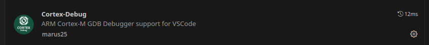
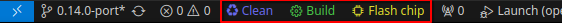

For `Vs Code` User, all project got à `.vscode` folder with à `launch.json` for debugging and à `tasks.json` to build and upload the firmware.
You can download theses extensions:

- `marus25.cortex-debug` for debugging ARM Cortex-M targets.

- `actboy168.tasks` to got quick shortcut of your tasks in your status bar

