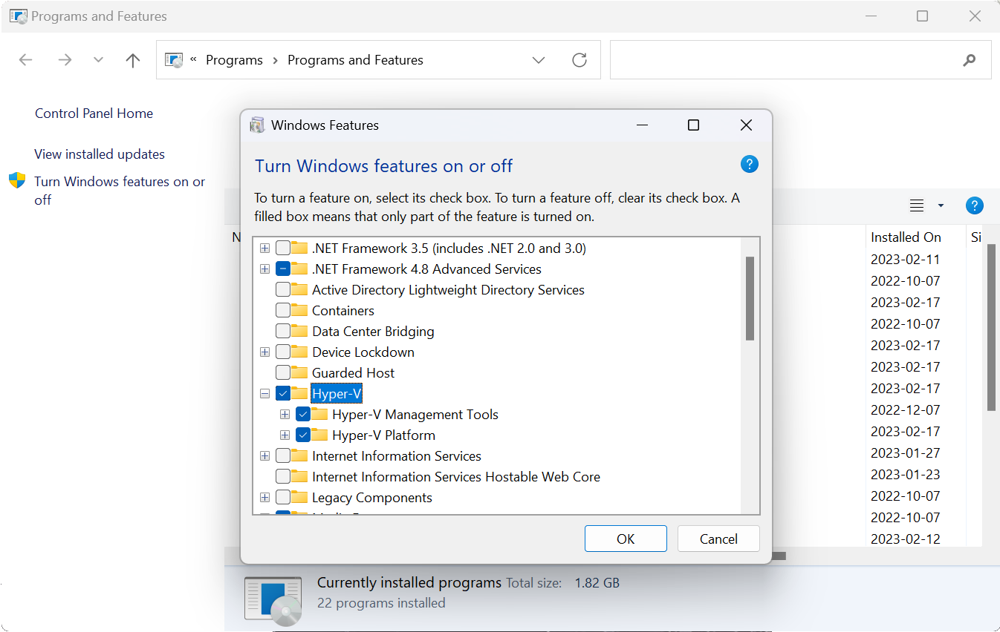

# Windows requirements 

## Tools

1. Create a `tools` folder (example : `C:\tools` )
2. Download [Zig](https://ziglang.org/builds/zig-windows-x86_64-0.14.0.zip)
3. Download [Arm GNU Toolchain](https://github.com/xpack-dev-tools/arm-none-eabi-gcc-xpack/releases/tag/v14.2.1-1.1)
4. Download [ST link](https://github.com/stlink-org/stlink/releases/tag/v1.8.0)
5. Download [OpenOCD](https://github.com/xpack-dev-tools/openocd-xpack/releases/tag/v0.12.0-4)
6. Extract everything to the folder `tools`. Just extract here, no subfolder creation needed

**ST link**

ST link got a problem on Windows and search configuration on a wrong location.
You will need to copy `C:\tools\stlink-1.8.0-win32\Program Files (x86)\stlink` to `C:\Program Files (x86)\stlink`.

**Setup environnement variables**

Here, the command to setup environnement variable according to the instructions below.
You need to choice between System wide or User level. Example below work if you use `C:\tools` 

- System wide (admin Powershell):

```powershell
[Environment]::SetEnvironmentVariable(
   "Path",
   [Environment]::GetEnvironmentVariable("Path", "Machine") + ";C:\tools\stlink-1.8.0-win32\bin;C:\tools\zig-windows-x86_64-0.14.0;C:\tools\xpack-arm-none-eabi-gcc-14.2.1-1.1\bin;C:\tools\xpack-openocd-0.12.0-4\bin",
   "Machine"
)
```
- User level (Powershell):

```powershell
[Environment]::SetEnvironmentVariable(
   "Path",
   [Environment]::GetEnvironmentVariable("Path", "User") + ";C:\tools\stlink-1.8.0-win32\bin;C:\tools\zig-windows-x86_64-0.14.0;C:\tools\xpack-arm-none-eabi-gcc-14.2.1-1.1\bin;C:\tools\xpack-openocd-0.12.0-4\bin",
   "User"
)
```


## Drivers

For STM32 Users. You will need [ST Link](https://www.st.com/en/development-tools/stsw-link009.html) Drivers to communicate with ST-Link devices.

## Containers (with podman)

You can use Podman on windows. Check [Podman for Windows](https://github.com/containers/podman/blob/main/docs/tutorials/podman-for-windows.md)

### 1. Enable Hyper-V on Windows 11

[Source](https://techcommunity.microsoft.com/blog/educatordeveloperblog/step-by-step-enabling-hyper-v-for-use-on-windows-11/3745905)

1. Press the `Windows key + R` to open the Run dialog box.
2. Type `appwiz.cpl` and press Enter.
3. In the Programs and Features window, select `Turn Windows features on or off` in the left-hand pane.
4. In the Windows Features window, scroll down to `Hyper-V` and check the box next to it.
     


5. Click on OK and wait for the installation process to complete.
6. Once the installation is complete, click on Restart Now to restart your computer.

### 2. Install WSL

[Source](https://learn.microsoft.com/fr-fr/windows/wsl/install)

```powershell
wsl --install
```

### 3. Install Podman

1. Download [Podman](https://github.com/containers/podman/releases) and install it.
2. Enable and start the podman machine

```powershell
podman machine init
podman machine start
```

### Notes

- You can use [Podman Desktop](https://podman-desktop.io/downloads) to manage image and containers with a GUI.
- No communication with USB devices. So you can't flash with the device